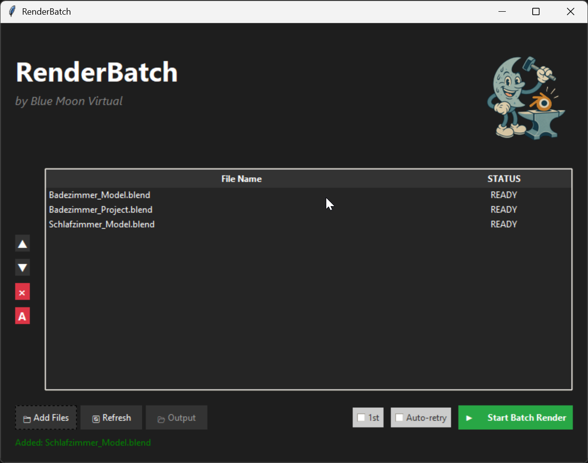

# RenderBatch

A modern, user-friendly batch render manager for Blender files, developed by Blue Moon Virtual.



## Features

- Drag and drop support for .blend files
- Intuitive queue management
- Modern, dark-themed UI
- Real-time job status updates
- Easy job reordering and removal
- Auto-hiding scrollbar
- Batch rendering capabilities

## Installation

### Windows
1. Download the latest release from the [Releases](https://github.com/yourusername/RenderBatch/releases) page
2. Place the executable in your desired location
3. Double-click to run

### From Source
1. Clone this repository
2. Install Python 3.8 or later
3. Install dependencies:
   ```bash
   pip install -r requirements.txt
   ```
4. Run the application:
   ```bash
   python RenderBatch.py
   ```

## Requirements

- Windows 10 or later
- Blender 4.3 or later installed at the default location:
  `C:\Program Files\Blender Foundation\Blender 4.3\blender.exe`

## Usage

1. Launch RenderBatch
2. Add .blend files by:
   - Dragging and dropping files into the window
   - Using the "Add Files" button
3. Use the control buttons to:
   - Move jobs up/down in the queue
   - Remove individual jobs
   - Remove all jobs
4. Click "Start Batch Render" to begin processing
5. Use the "Cancel" button to stop the current job

## Building

To build the executable yourself:

```bash
pyinstaller RenderBatch.spec
```

The executable will be in the `dist` folder.

## License

This project is licensed under the MIT License - see the [LICENSE](LICENSE) file for details.

## Contributing

Contributions are welcome! Please feel free to submit a Pull Request.

## Support

For support, please open an issue in the GitHub repository. 